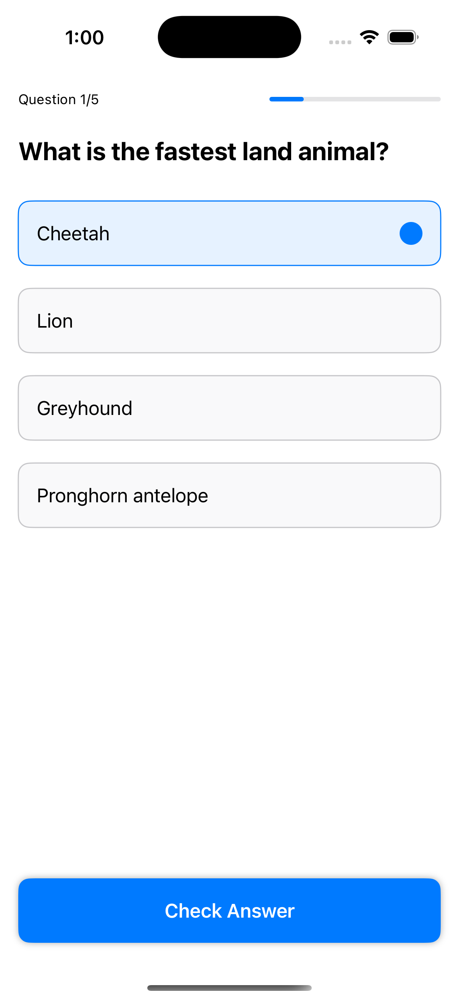
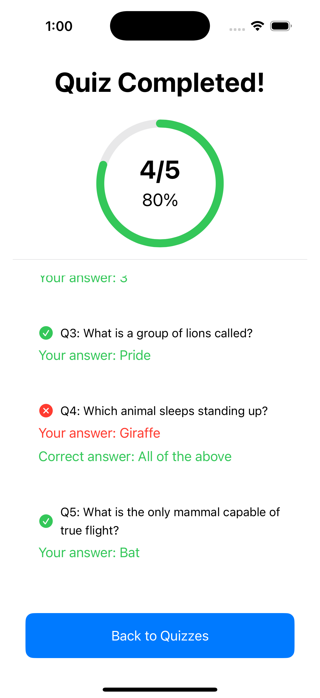

# QuizzGame - SwiftUI iOS Quiz App


A simple but dynamic quiz application built with SwiftUI.

## 📱 Features

### Core Requirements
✔ **Two Complete Quizzes** (5 questions each)  
✔ **Interactive Question Flow** with single-choice selection  
✔ **Real-time Validation**:  
   - ✅ Green highlight for correct answers  
   - ❌ Red highlight & correct answer reveal for wrong answers  
✔ **Results Screen** with score summary  
✔ **Button State Management**:  
   - "Check Answer" disabled until selection  
   - Transforms to "Next" after validation  

### Bonus Features
⭐ **Disabled Back Navigation** during quizzes  
⭐ **Detailed Question Breakdown** in results  
⭐ **Smooth Animations** between states  

## 🛠 Tech Stack

- **SwiftUI** for declarative UI
- **MVVM** architecture pattern
- **State Management**:
  - `@State` for view-specific data
  - `Binding` for parent-child communication
- **Navigation**:
  - Custom `UIViewControllerRepresentable` for gesture control
  - `NavigationStack` for routing
 
## 📸 App Walkthrough

| Quiz Selection | Question Screen | Results Summary |
|----------------|-----------------|-----------------|
|  |  |  |

## 🚀 Getting Started

### Prerequisites
- Xcode 13+
- iOS 15+ simulator or device

### Installation
1. Clone the repository
```bash
git clone https://github.com/Minisock/QuizzGame.git
```
2. cd QuizzGame
3. open QuizzGame.xcodeproj

### Running the App
1. Select a simulator/device in Xcode
2. Press ⌘ + R to build and run
3. Test both quizzes and all answer states

